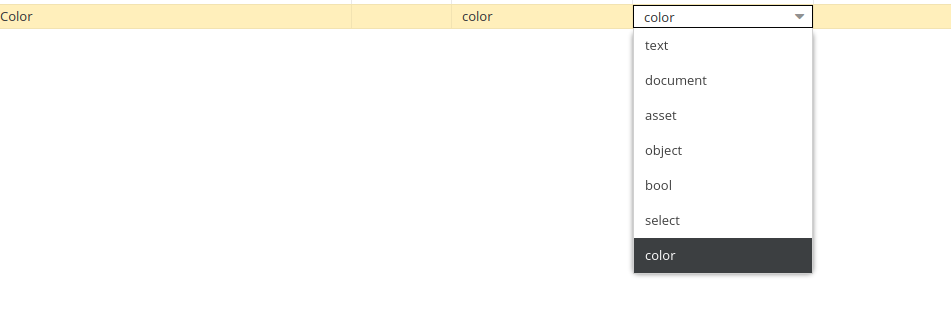
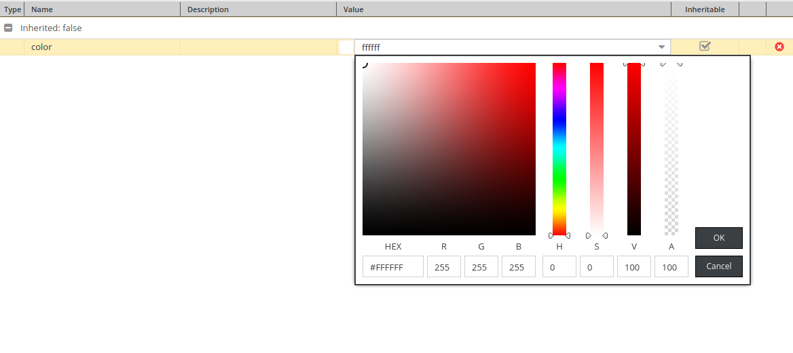

# Pimcore Property color type

This is dirty workaround because there is no API available for element properties. Javascript code based on Pimcore 4.6.0.

## Installation
```
composer require niepsuj/pimcore-property-color-type
```

## Screenshots

